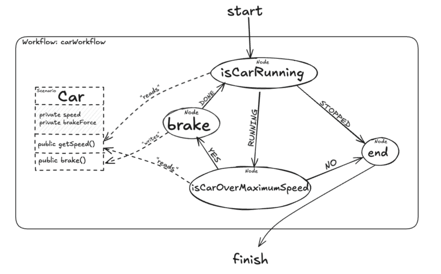

# Moira Library

Moira is a library for managing and executing workflows reactively in Java applications. It uses Reactor to execute
decision nodes asynchronously and provides a straightforward interface for handling complex workflows.

## Features

- **Asynchronous Execution**: Uses Reactor for non-blocking workflow execution.
- **Node Management**: Allows execution of nodes based on scenario and decisions.
- **Execution Logging**: Includes detailed logging of execution flow and decision results.
- **Flexible Configuration**: Compatible with projects of various frameworks.

## Requirements

- **Java**: 11 or higher

## Maven dependency

First add jitpack.io repositories to your `pom.xml`:

```xml

<repositories>
    <repository>
        <id>jitpack.io</id>
        <url>https://jitpack.io</url>
    </repository>
</repositories>
```

Then add the following dependency to your `pom.xml`:

```xml

<dependencies>
    
    <dependency>
        <groupId>com.github.daplazafer</groupId>
        <artifactId>moira</artifactId>
        <version>1.0.0</version>
    </dependency>
    
</dependencies>
```

## Usage

For a practical example of how to use this library, check out
my [dop-moira-spring-example repository](https://github.com/daplazafer/dop-moira-spring-example) for further info.




### Configuring Moira library

Configure properties in `moira.properties` in your resources directory. This is an example with the default values:

```properties
workflowFilesPath=workflows
hotReloadMode=false
```

### Configuring Nodes

Annotate your node classes with `@Decision` to define id and description and extend Node class. You can use whatever
class you want to work as a scenario.

My advice of managing Node responses is the following:

```java
import com.dpf.example.dop.node.IsCarRunningNode.Result;

import static com.dpf.example.dop.node.IsCarRunningNode.Result.RUNNING;
import static com.dpf.example.dop.node.IsCarRunningNode.Result.STOPPED;

@Decision(id = "isCarRunning", description = "Is the car running?")
public class IsCarRunningNode extends Node<Car, Result> {

    public enum Result {
        RUNNING, STOPPED
    }

    @Override
    public Result execute(Scenario<Car> scenario) {
        return scenario.get().getSpeed() > 0 ? RUNNING : STOPPED;
    }
}

```

Example scenario:

```java
package com.dpf.example.dop.scenario;

import lombok.AllArgsConstructor;
import lombok.Getter;
import lombok.ToString;

@Getter
@AllArgsConstructor
@ToString
public class Car {

    private int speed;

    private int brakeForce;

    public void brake() {
        this.speed -= this.brakeForce;
    }
}
```

### Configuring Workflows

Create a yml file and place it into the directory configured with `workflowFilesPath` variable.

```yml
id: car
start: isCarRunning
nodes:
  - id: isCarRunning
    transitions:
      - result: RUNNING
        next: isCarOverMaximumSpeed
      - result: STOPPED
        next: end
  - id: isCarOverMaximumSpeed
    transitions:
      - result: YES
        next: brake
      - result: NO
        next: end
  - id: brake
    transitions:
      - result: DONE
        next: isCarRunning
  - id: end
```

### Running a Workflow

Create an instance of Moira and call the `decide` method:

```java
import com.dpf.moira.Moira;

import com.dpf.example.dop.scenario.Car;

public class Application {

    public static void main(String[] args) {

        Moira moira = new Moira(List.of(
                new IsCarRunningNode(),
                new BrakeNode(),
                new IsCarOverMaximumSpeedNode(),
                new TerminalNode()));

        Car carScenario = new Car(120);

        moira.decideAsync("carWorkflow", carScenario);
    }
}
```

It is also an alternative with **Spring** annotating all `@Decision` also with `@Component`. Then you can configure a `@Bean`:

```java
package com.dpf.example.dop;

import com.dpf.moira.Moira;
import com.dpf.moira.Node;
import org.springframework.beans.factory.annotation.Autowired;
import org.springframework.context.annotation.Bean;
import org.springframework.context.annotation.Configuration;

import java.util.Collection;

@Configuration
public class MoiraConfig {

    @Bean
    @Autowired
    public Moira createMoira(Collection<Node<?, ?>> nodes){
        return new Moira(nodes);
    }

}
```

### Logging

Execution logs are recorded using SLF4J. Make sure to configure your logging system to view the details. To debug Moira
executions:

```properties
logging.level.com.dpf.moira.Moira=DEBUG
```

## Contributing

Contributions are welcome. Please follow these steps to contribute:

Fork the repository.

- Create a new branch `git checkout -b feature-branch`.
- Make your changes and commit `git commit -am 'Add new feature`.
- Push your changes `git push origin feature-branch`.
- Create a Pull Request on GitHub.

## License

This project is licensed under the MIT License - see the LICENSE file for details.

## Contact

For any questions or comments, contact me [here](mailto:dpf220691@gmail.com).
